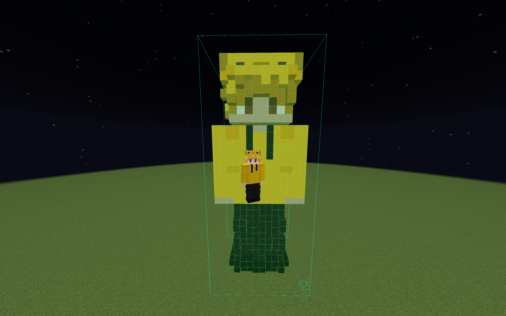

# Skin to Litematica Converter

Convert Minecraft player skins into 3D block sculptures as Litematica schematic files.



## Features

-  **Fetch by Username** - Automatically download skins from Mojang API
-  **Slim Skin Support** - Handles both Alex (3px arms) and Steve (4px arms) models
-  **Overlay Layers** - Hat, jacket, sleeves rendered as separate outer layer
-  **Batch Convert** - Convert multiple players into one schematic
-  **Optimized Palette** - Uses only wool, concrete, and terracotta blocks

## Installation

### Requirements
- Python 3.8+
- pip

### Setup

```bash
# Clone the repository
git clone https://github.com/ponpon77/skin-to-litematica.git
cd skin-to-litematica

# Install dependencies
pip install -r requirements.txt
```

## Usage

### Single Player (by username)

```bash
python skin_to_litematica.py --username Notch
```

### Single Player (from file)

```bash
python skin_to_litematica.py player.png -o output/player_sculpture.litematic
```

### Batch Conversion

Edit `batch_convert.py` and add your player names, then run:

```bash
python batch_convert.py
```

## Command Line Options

```
usage: skin_to_litematica.py [-h] [--username USERNAME] [-o OUTPUT] [--slim] [--classic] [input]

positional arguments:
  input                 Path to skin PNG file

optional arguments:
  -h, --help            show this help message and exit
  --username USERNAME   Minecraft username to fetch skin
  -o, --output OUTPUT   Output .litematic file path
  --slim                Force slim (Alex) model
  --classic             Force classic (Steve) model
```

## Output

The converter generates `.litematic` files compatible with the [Litematica](https://www.curseforge.com/minecraft/mc-mods/litematica) mod.

### To use in Minecraft:
1. Install Litematica mod (requires Fabric)
2. Copy the `.litematic` file to `.minecraft/schematics/`
3. In-game: Press `M` → Load Schematics → Select your file

## Block Palette

The converter uses only these block types for consistent coloring:
- **Concrete** (16 colors)
- **Wool** (16 colors)
- **Terracotta** (17 colors)

No gravity blocks (sand, gravel, concrete powder) are used.

## Project Structure

```
skin-to-litematica/
├── skin_to_litematica.py    # Main CLI script
├── batch_convert.py         # Batch conversion script
├── requirements.txt         # Python dependencies
├── modules/
│   ├── __init__.py
│   ├── skin_parser.py       # Skin texture extraction
│   ├── skin_fetcher.py      # Mojang API integration
│   ├── color_mapper.py      # Color to block mapping
│   ├── model_builder.py     # 3D model construction
│   └── litematica_writer.py # .litematic file generation
└── output/                  # Generated schematics
```

## How It Works

1. **Fetch Skin** - Downloads player skin from Mojang API or loads from file
2. **Parse Textures** - Extracts 6 faces for each body part (head, body, arms, legs)
3. **Map Colors** - Converts each pixel to the closest Minecraft block
4. **Build Model** - Assembles body parts into 3D voxel model
5. **Write File** - Saves as Litematica schematic format

## License

MIT License - See [LICENSE](LICENSE) for details.

## Contributing

Contributions are welcome! Please open an issue or pull request.

## Credits

- Uses [litemapy](https://github.com/SmylerMC/litemapy) for schematic generation
- Skin data from [Mojang API](https://wiki.vg/Mojang_API)
